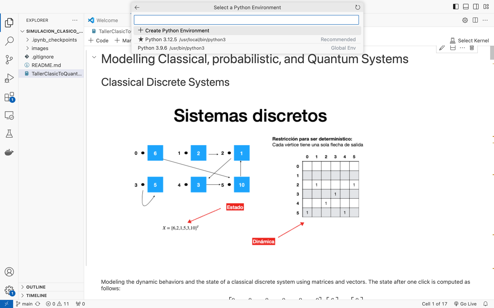
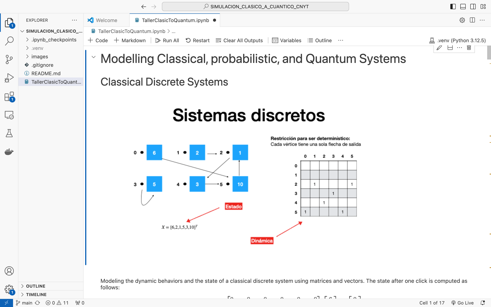

# TEORIA CUANTICA BASICA OBSERVABLES Y MEDIDAS

Este repositorio contiene un cuaderno de Jupyter relacionado con Complejos . El cuadernos cubren las diferentes operaciones que puedo realizar con los observables, proporcionando ejemplos y análisis que pueden ser útiles.

## Contenidos

El cuaderno de ejercicios y funciones tiene las siguientes grandes secciones.

### SIMULACIÓN DEL PRIMER SISTEMA CUÁNTICO DESCRITO EN LA SECCIÓN 4.1.
    El sistema consiste en una partícula confinada a un conjunto discreto de posiciones en una línea. El simulador debe permitir especificar el número de posiciones y un vector ket de estado asignando las amplitudes.

#### OPERACIONES REALIZADAS

    1. El sistema debe calcular la probabilidad de encontrarlo en una posición en particular.

    2. El sistema si se le da otro vector Ket debe buscar la probabilidad de transitar del primer vector al segundo.

### RETOS DE PROGRAMACIÓN DEL CAPÍTULO 4.

    1. Amplitud de transición. El sistema puede recibir dos vectores y calcular la probabilidad de transitar de el uno al otro después de hacer la observación

    2. Ahora con una matriz que describa un observable y un vector ket, el sistema revisa que la matriz sea hermitiana, y si lo es, calcula la media y la varianza del observable en el estado dado.

    3. El sistema calcula los valores propios del observable y la probabilidad de que el sistema transite a alguno de los vectores propios después de la observación.

    4. Se considera la dinámica del sistema. Ahora con una serie de matrices Un el sistema calcula el estado final a partir de un estado inicial.

### SOLUCIÓN DE LOS PROBLEMAS DE EJEMPLO
Los ejercicios que se realizaron fueron:
- 4.3.1
- 4.3.2
- 4.4.1
- 4.4.2

## Requisitos

Para ejecutar los cuadernos, necesitarás instalar las siguientes herramientas y bibliotecas:

- Visual Studio Code: Lo utilizaremos para crear el entorno virtual de Python 
- [Python 3.12](https://www.python.org/downloads/)
- Bibliotecas necesarias (puedes instalarlas con el siguiente comando): pip
    - **Numpy**

## ¿Cómo obtener una copia del repositorio?
### Pre-requisitos
Antes de comenzar con la ejecución de este proyecto, es necesario asegurarse de que se tiene instalado Python en su computador, debido a que este es el lenguaje de programación utilizado para desarrollar este proyecto. 
En caso de no tenerlo siga los siguientes pasos:
1. Dirigirse a la página https://www.python.org/downloads/
2. Dar click en la opción de descarga
   - 
   
4. Ejecutar el programa que se descarga automáticamente.

### Instalación 
Para instalar la librería debe tener en cuenta estos pasos:
1. Abra la carpeta en donde desea guardar la librería.
2. De click derecho y seleccione la opción "Git Bash"
3. Clone el repositorio utilizando el comando 'https://github.com/Mar972310/TEORIA_CUANTICA_BASICO_OBSERVABLES_MEDIDAS.git'
5. Seleccione su editor de código (Visual Studio Code) y agregue un entorno virtual de python

6. Ejecute la seccion que quiera compilar (rectangulo color amarillo) o todo el cuaderno (rectangulo color rosa) .

## Ejercicios de discusión

    
## Construido con
* Phyton 3.12.5
* Jupyter Notebook 7.1
  
## Autor 
__Maria Valentina Torres Monsalve__ 